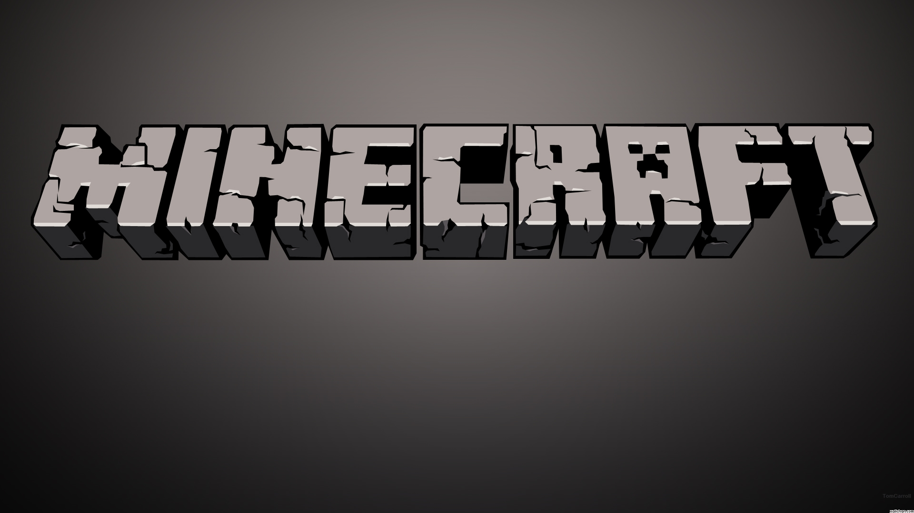

# Minecraft Clone in Godot

> Minecraft Game built using the Godot game engine.

## Table of Contents
- [Introduction](#introduction)
- [Features](#features)
- [Screenshots](#screenshots)
- [Installation](#installation)
- [How to Play](#how-to-play)
- [Contributing](#contributing)
- [License](#license)
- [Credits](#credits)

## Introduction

This project is a Minecraft-inspired game developed using the Godot game engine. It aims to replicate core features of Minecraft, such as block building, terrain generation, and basic gameplay mechanics.

## Features

- **Block Building**: Place and remove blocks to create structures.
- **Procedural Terrain Generation**: Dynamic world generation with different biomes.
- **Day-Night Cycle**: Realistic day and night transitions.
- **Basic Player Movement**: Move around the world and interact with blocks.
- **Inventory System**: Collect and use different types of blocks.
- **Simple Crafting**: Combine materials to create new blocks.

## Screenshots

## Installation

1. **Download the Executable**
   - Go to the [Releases](https://github.com/yourusername/minecraft-clone-godot/releases) section of this repository.
   - Download the latest version of the executable (`minecraft-clone-godot.exe`).

2. **Run the Executable**
   - Locate the downloaded `minecraft-clone-godot.exe` file.
   - Double-click to run the game.

## How to Play

- **Movement**: Use `W`, `A`, `S`, `D` to move around.
- **Jump**: Press `Space`.
- **Interact**: Use `Left Click` to remove a block and `Right Click` to place a block.
- **Change Blocks**: Use the mouse scroll wheel or number keys `1-9` to change the active block type.

## Contributing

Contributions are welcome! Please follow these steps:

1. Fork the repository.
2. Create a new branch (`git checkout -b feature/YourFeature`).
3. Commit your changes (`git commit -m 'Add YourFeature'`).
4. Push to the branch (`git push origin feature/YourFeature`).
5. Create a Pull Request.

## License

This project is licensed under the MIT License. See the [LICENSE](./LICENSE) file for details.

## Credits

- **Godot Engine** - [Godot Engine](https://godotengine.org/)
- **Minecraft** - Inspiration for the project.

---

### Detailed Sections:

#### Introduction

This game is a tribute to the creativity and open-world mechanics of Minecraft, recreated in Godot. The goal is to provide a learning platform for game development enthusiasts who wish to understand procedural generation, voxel graphics, and basic game mechanics using Godot.

#### Features

- **Voxel-Based Terrain**: The game world is made of voxels, or volumetric pixels, which are the building blocks of the terrain.
- **Infinite Terrain**: The terrain is procedurally generated, allowing for theoretically infinite exploration.
- **Inventory System**: Collect blocks and items in an inventory, similar to the classic Minecraft gameplay.
- **Day/Night Cycle**: Experience the passage of time with a cycle that affects lighting and gameplay.
- **Simple Crafting Mechanics**: Combine resources to craft new blocks or items.

#### Screenshots

*Main Menu of the Minecraft Clone.*

*Gameplay showing block building and terrain.*

#### Installation

To get the game up and running, follow these steps:

1. **Download the Executable**
   - Go to the [Releases](https://github.com/yourusername/minecraft-clone-godot/releases) section of this repository.
   - Download the latest version of the executable (`minecraft-clone-godot.exe`).

2. **Run the Executable**
   - Locate the downloaded `minecraft-clone-godot.exe` file.
   - Double-click to run the game.

#### How to Play

- **Movement Controls**: Move using `W`, `A`, `S`, `D`.
- **Jump**: Press `Space` to jump.
- **Interact with Blocks**: Use `Left Click` to destroy blocks and `Right Click` to place blocks.
- **Switch Blocks**: Scroll the mouse wheel or press `1-9` to select different block types from the inventory.

#### Contributing

To contribute to the project, follow these guidelines:

1. **Fork the repository** to your own GitHub account.
2. **Create a new branch** from the `main` branch with a descriptive name for your feature or fix.
3. **Make your changes** and commit them with clear and concise messages.
4. **Push your changes** to your forked repository.
5. **Create a Pull Request** from your forked repository’s branch to the `main` branch of this repository.

#### License

This project is licensed under the MIT License. Please refer to the [LICENSE](./LICENSE) file for full terms.

#### Credits

- **Godot Engine**: This game is built using the [Godot Engine](https://godotengine.org/).
- **Minecraft**: This project draws inspiration from [Minecraft](https://www.minecraft.net/).

---
